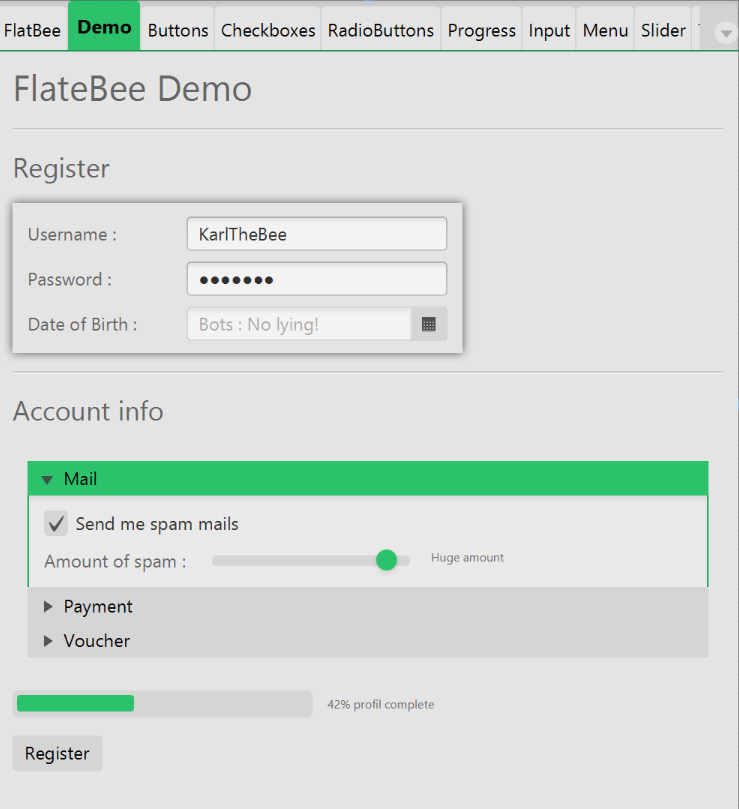
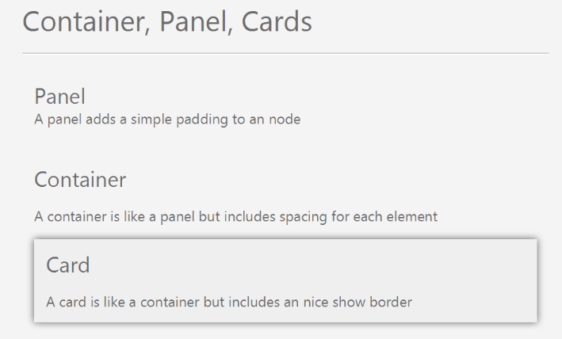

# FlatBee v1.0.0
A flat and smooth looking css theme for JavaFX.
Already includes the most used UI elements, but still very work in progress.

## Preview

More examples at ['src/test/resources/img'](https://github.com/KarlTheBee/FlatBee/tree/master/src/test/resources/img "Yes, there's the other images")

This theme includes a small example application. Just start the class App at package ['com.github.karlthebee.flatbee'](https://github.com/KarlTheBee/FlatBee/tree/master/src/main/java/com/github/karlthebee/flatbee "Yes, there's the other images")

## Styling
Aside from the quite nice theme, I've added a few options for a conistent design

### Sizes
FlatBee offers a few different sizes for every node. From smallest to biggest there are : 
- flatbee-tiny
- flatbee-small
- flatbee-medium
- flatbee-large
- flatbee-xlarge
- flatbee-xxlarge
- flatbee-xxxlarge
- flatbee-jumbo

### Panels
A panel adds a simple padding to an node

### Containers
A container is like a panel but includes spacing for each element

### Cards
A card is like a container but includes an nice show border

## Setup
* Installing : Download the 'flatbee.css' file (or copy this repository) and paste the file into your workspace. Just the css file is needed, everything else is a nice package/demo
* Changing the main color : At 'flatbee.css' set the '-color' value to your [color of choice](http://flatuicolors.com/ "A few flat colors to choose from")
* ???
* Profit (non-commercial)

## Progress
Works :
- Labels
- Buttons (including toogle- & split-buttons)
- Progressbars & Progressindicators
- Datepicker
- Slider
- Comboboxes
- Tabpanes & Tabs
- Checkboxes & Radiobuttons
- TextFields, Inputs, Spinner
- (Tree-)Tables
- Colorpicker

Problems/Bugs :
- Not all default javafx8 nodes are styled
- Third-party nodes may look ugly and/or green-ish
- Other minor display bugs I didn't notice yet

## License
The license is pretty much a CC-BY-NC 4.0 license (https://creativecommons.org/licenses/by-nc/4.0/).
In simple (non legal) english : you can modify and distribute it, ship in in your application, but not use/sell it commercially. And you have to give credits, like "FlatBee theme by karlthebee (https://github.com/karlthebee/flatbee)"