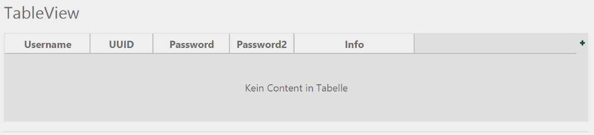

# FlatBee
A flat and smooth looking css theme for JavaFX.
Already includes most used UI elements, but still very work in progress.

## Preview

## How-To Theme
- Change the basic theme color : Change the "-color" value in the theme at around line 14
- Different html-like text sizes are available and in descending size : "h1", "h2", <standard>, "h3"
- There's a "bordered" pane which sets an nice padding and spacing for an pane

## Progress
Should work :
- Labels
- Buttons (including toogle- & split-buttons)
- Progressbars & Progressindicators
- Datepicker
- Slider
- Comboboxes
- Tabpanes & Tabs
- Checkboxes & Radiobuttons
- TextFields, Inputs, Spinner
- (Tree-)Tables

Does not work : 
- Not all default javafx8 nodes styled
- Many nodes may look ugly and to green-ish

## License

The license is pretty much a CC-BY-NC 4.0 license (https://creativecommons.org/licenses/by-nc/4.0/).
You can modify,use and share it (and ship it with your application), as long as you don't sell the file (or the application which includes the file).
You also have to give me credit, like "FlatBee theme by karlthebee (github.com/karlthebee/flatbee)"