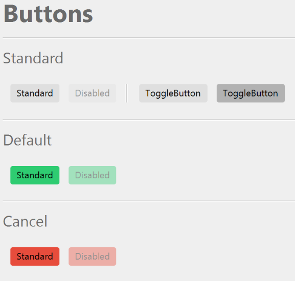
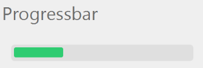
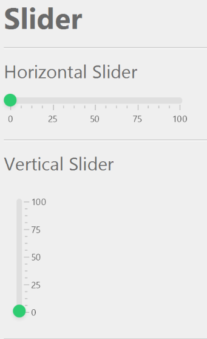

# FlatBee
An flat and smooth looking css theme for JavaFX.
Still very work in progress but you can join me :)

## Preview

## How-To Theme
- Change the basic color : Change the -color value at the first lines of the css file
- set a nice border to a pane : set the id "bordered" to the pane
- set different label sizes : set the id "h1" (for really big labels), "h2" (for big labels") and "h3" for very small labels

## Progress
- All kinds of buttons look nice
- Progresses looks okayish
- Slider works
- Tabpane looks nice
- Radioboxes & Checkboxes do work

- Other things may look ugly

## License

The license is pretty much a CC-BY-NC 4.0 license (https://creativecommons.org/licenses/by-nc/4.0/).
You can modify,use and share it (and ship it with your application), as long as you don't sell the file (or the application which includes the file).
You also have to give me credit, like "FlatBee theme by karlthebee (github.com/karlthebee/flatbee)"